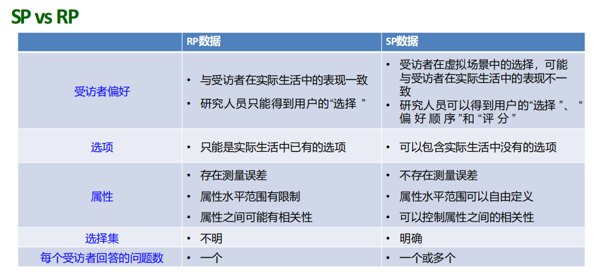
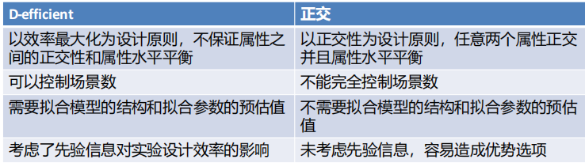

# 第二部分 交通行为调查
## 综述
- **常用交通调查方式**:
  - 定量: 直接观测, 居民出行调查, 拦截调查, SP调查.
  - 定性: 访谈, 焦点小组, 德尔菲法(专家意见法).
- **常用抽样方法**:
  - 随机抽样: 简单随机抽样, 分层随机抽样,多阶段抽样, 整群抽样(聚类抽样), 系统抽样(机械抽样, 等距抽样).
  - 非随机抽样: 基于选择的抽样, 定额抽样, 滚雪球抽样.
- SP与RP的区别
  - **RP调查**: Revealed preference, 调查用户选择时做了什么.
  - **SP调查**: Stated preference, 调查用户在选择时会做什么.

- **SP实验结构**:
  - 第一部分: 受访者分块, 受访者现实出行行为.
  - 第二部分: SP调查场景.
  - 第三部分: 受访者的社会经济学特征与态度.
- **SP实验场景**:
  - 背景描述.
  - 选项.
  - 属性配置. 用于描述每个选项的特点.
  - 用户选择.
- **标签**: 
  - 一种产品, 服务, 或品牌.
  - 存在附加价值.
## SP实验设计
- **选项**, **属性**, **属性水平**的确定:
  - 取决于研究目标.
  - 不要过多或过少, 关键的选项或属性不可缺少.
  - 避免过于主观, 模糊不清的属性.
  - 属性水平的范围需合理, 选择好理解的属性水平.
- **场景数目**的确定:
  - 上限: 取决于受访者的忍耐程度, 通过预调查确定.
  - 下限: $(J-1)S\geq K$.
    - $J$: 选项数量.
    - $S$: 场景数.
    - $K$: 属性数.
- 通过实验设计写效用函数: $U_i=C_i+\beta_{ij}\times 选项$.
  - 注意 $J$ 个选项最多 $J-1$ 个常数项. 常数项表示选项的**标签**.
  - **协变量**: 受访者的属性.
- **数据收集方法**:
  - 纸质调查.
  - 线上调查.
  - 计算机辅助面访.
## SP调查统计设计
- **全因子设计**: 包含所有属性水平组合的设计.
- **部分因子设计**: 在全部场景中选择一部分展示给受访者.
  - 随机设计: 随机选择.
  - 正交设计: 保证设计变量之间正交.
  - 效率设计: 使得拟合模型参数的标准差最小.
- **正交设计**的概念:
  - 两个属性之间无相关性.
  - 每个属性水平的组合出现次数有相同.
  - 实际情况下, 要求每两列之间不同数据对的出现次数相同.
- 正交设计的**缺陷**:
  - 属性水平分布不均, 数据缺失, 分块缺失, 导致数据无法正交.
  - 无标签SP难以处理优势选项.
  - 所需要的场景数过多.
- **分块设计**: 让每一个受访者回答所有场景中的一部分场景.
  - 可以减小每一个受访者回答的问题数.
  - 目标群体异质性明显时, 需要做分块设计.
## 效率设计
- 目的: 使模型拟合出的参数可信度更高, 即标准差更小.
- **评价指标**:
  - D-error: $[\det(\Omega_1)]^{\frac{1}{K}}$.
  - A-error: $\frac{\mathrm{tr}(\Omega_1)}{K}$, 即**平均方差**. 
  - $\Omega_1$: 费雪信息矩阵. $K$: 需要衡量的参数个数, 即 $\Omega_1$ 的阶数.
  - D-error 或 A-error 越小, 设计效率越高.

## 均匀设计
- 目的: 只考虑试验点在试验范围内均匀散布.
- 通过均匀表安排试验. 不考虑整齐可比, 大幅减少了试验次数.
- 特点:
  - 每个因素在每个水平仅有1个实验点.
  - 任意2个因素的组合仅出现一次.
- **适用范围**:
  - 试验因素变化范围较大, 需要取较多水平.
  - 试验成本较高.
- 方法: 查询均匀设计表.