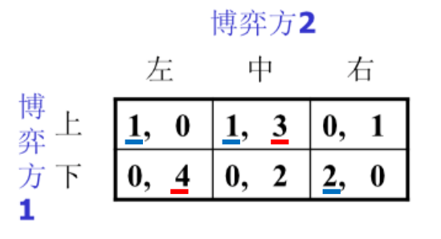
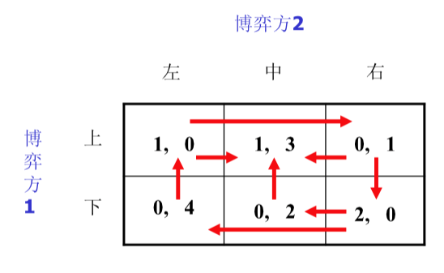

# 第三部分 博弈论
## 基本概念
### 决策选择过程
- **基本要素**: 决策者, 备选方案集合, 方案属性, 决策准则.
- 单人决策: 价值理论.
- **理性经济人**: 人理性, 单一目标, 所有选项及备选方案已知, 偏好明确且稳定, 选择效果最佳.
- 多人决策: 群体智能.
### 博弈论基础
- **定义**: 博弈论亦称对策论. 个人/队组等在一定环境条件及规则下, 同时/先后, 一次/多次, 从允许的行动或策略中选择并加以实施, 并从中取得相应结果的过程.
- **基本要素**:
  - **参与人**: 博弈中选择行动以最大化效用的决策主体.
    - 单人: 参与者仅有一方.
    - 双人: 对抗/合作.
    - 多人: 三个及以上的人. 可能存在 "破坏者".
  - **行动**: 博弈过程中轮到自己选择时所做的具体决策. 多个参与人形成**行动组合**
    - 根据行动先后, 分为静态博弈, 动态博弈, 重复博弈.
  - **策略**: 参与人选择行动的规则.
    - 策略空间: 参与人的所有策略集合.
    - 策略组合.
  - **损益**: 参与人在博弈结束后获得的效用.
    - 分为零和博弈, 常和博弈, 变和博弈.
  - **信息**: 参与人在博弈中所知的自己与他人的知识.
    - 根据有无确定性, 分为完全信息/不完全信息.
    - 在动态博弈中, 任一决策点处无不确定性. 即历史信息为共同知识.
  - **均衡**: 所有参与人的最优策略或行动的组合.
- **集体理性**: 集体的利益最大化. 个体理性 $\neq$ 集体理性.
- **描述方式**: 
  - 战略式: 通过列表, 展示出没人的策略空间, 以及对应的收益函数.
  - 扩展式: 通过博弈树进行描述.
### 机制设计
- 目的: 设计可以达到期望收益的博弈, 亦称为反博弈论.
- 基本概念:
  - 机制设计者(中央集权).
  - 替代选择(公共物品): 参与者的最低收益.
  - 资金转移.
  - 收益函数.(公共物品+资金转移)
### 博弈解(均衡)
- **最优解**:
  - 社会最优解: 参与者的回报之和最大.
  - 帕累托最优: 不存在所有人境况不变差, 且有人境况变好的情况.
  - 弱帕累托最优: 存在一种改进方案, 使得一个目标函数值不变, 其他的目标函数值变优.
  - **纳什均衡**: 给定策略组合中其他参与者选择, 无人有积极性改变自己的选择.
- **策略**: 
  - **占优策略**: 不管其他博弈方采取什么行动, 所采取的行动总能带来最大收益.
    - 占优策略均衡: 每个人均有占优策略 $S_i'$, 则 $S'=\{S_1',\ldots,S_i'\}$ 为均衡时的策略组合. 占优策略均衡是纳什均衡的一种特例.
  - 重复剔除纳什均衡: 去掉严格劣势策略形成的均衡.
  - **混合策略**: 与**纯策略**相对. 在每个给定信息下, 以某种概率选定不同策略.
- 其他均衡
  - **颤抖手精炼均衡**: 不仅在其他参与人不犯错误时最优, 在其他人偶尔犯错误时依然最优.
    - 是纳什均衡, 且没有一个参与人的策略为弱劣策略.
  - **相关均衡**: 玩家的策略选择不独立, 在所有玩家的策略组合上添加概率分布.
  - **子博弈精炼纳什均衡**: 参与人**序贯理性**. 不论过去发生什么, 总在当前节点最优化自己的策略.
  - **贝叶斯纳什均衡**: 在不完全信息静态博弈中的均衡.

## 静态博弈
- 任何有限完全信息静态博弈均存在至少一个纳什均衡. (纯策略或混合策略)
### 有限策略零和博弈
- 分析思路: 寻找**MaxMin解**.
  - 对于参与者A, 每行取效用最小值, 在小中取大.
  - 对于参与者B, 每列取效用最大值, 在大中取小.
  - 若两者重合, 则**鞍点**存在, 对应的均衡解存在.
### 有限策略非合作博弈
- **划线法**: 对于每个博弈方, 针对对方的不同选择选取自己的最优解. (即重复剔除严格劣策略)
- **箭头法**: 存在改进空间时, 引出箭头, 找到所有箭头指向的终点.
### 无限策略非合作博弈
- 古诺模型
  - 反应函数求偏导, 令偏导为0.
- 伯特兰德双寡头模型.

### 不完全信息静态博弈

- 海萨尼转换: 不完全信息静态 $\to$ 完全但不完美信息的动态博弈.
  - 引入虚拟的自然参与者.

## 动态博弈
- 用扩展式描述, 引入博弈树.
- 完美回忆.
- 逆推归纳法: 从子博弈向前推理.
- 斯塔克伯格模型. 
  - 类似双寡头模型. 对厂商2, 给定 $q_1$, 求 $\max U(q_1,q_2)$. 对厂商1同理.

## 合作博弈
强调集体理性.
- $n$ 人博弈, $n$ 个联盟.
- 分配向量: 合作博弈的解.
- 特征函数 $v$: 确定最优解.
- 超可加性: $v(s)+v(T)\leq v(S\cup T)$.
- 实质联盟: 取等. 反之不取等.

- 核心: 所有优分配方案的集合.
- 核仁: 最大超出最小化.
- 夏普利值: 增加1人产生的边际效应.