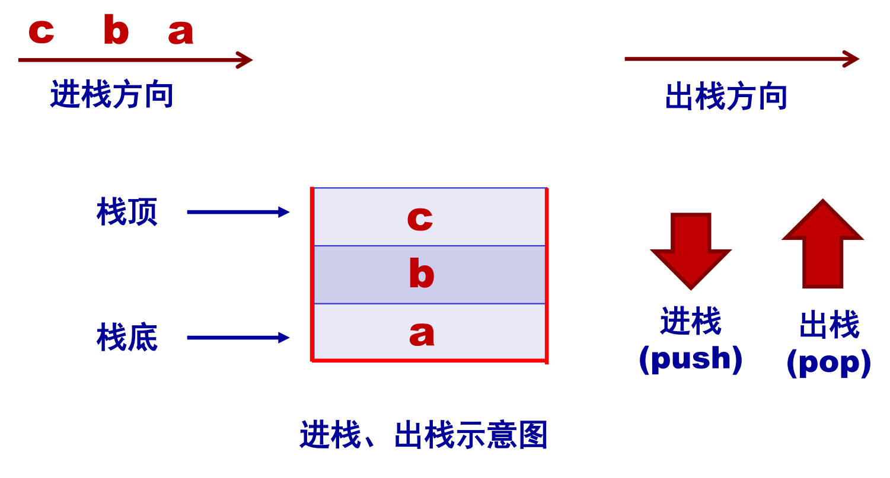
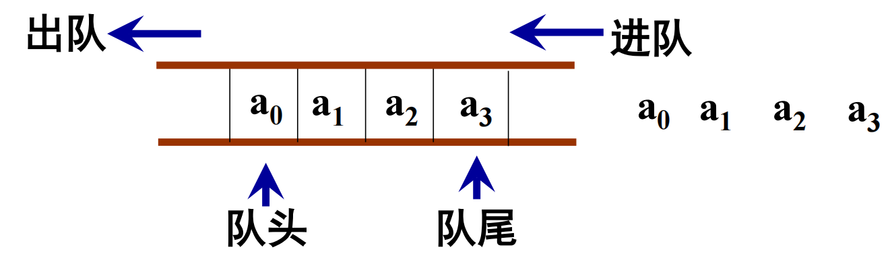
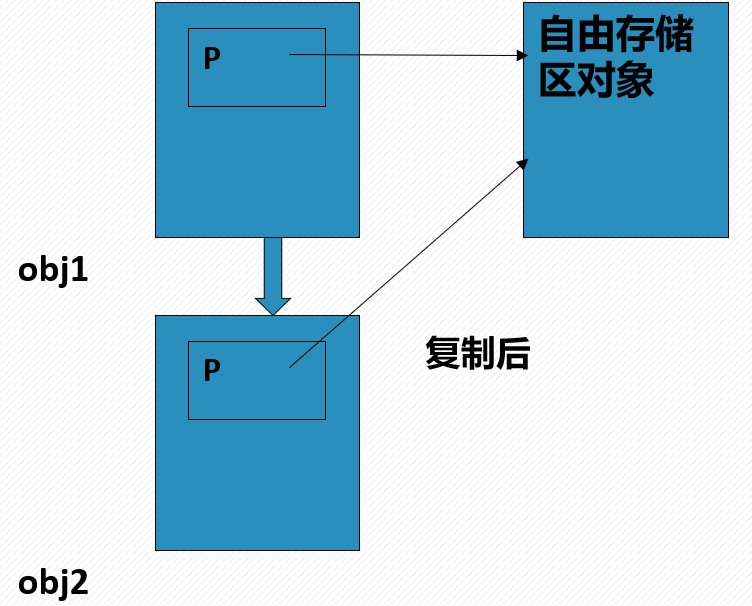
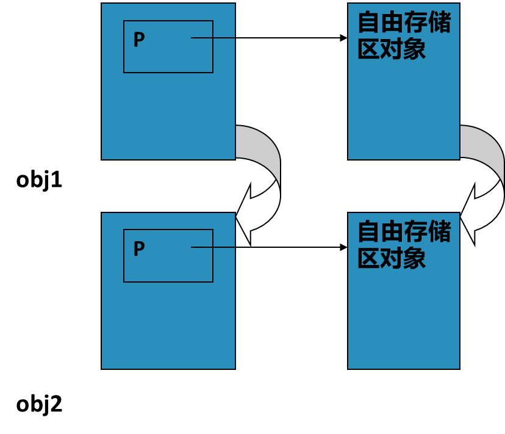
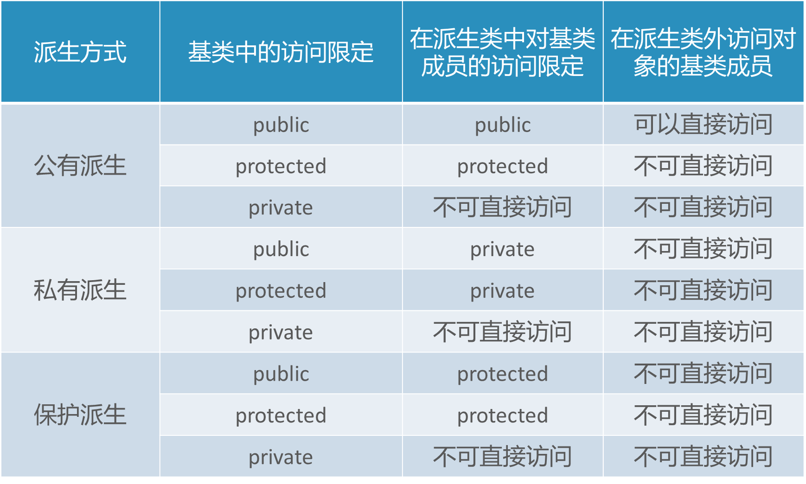
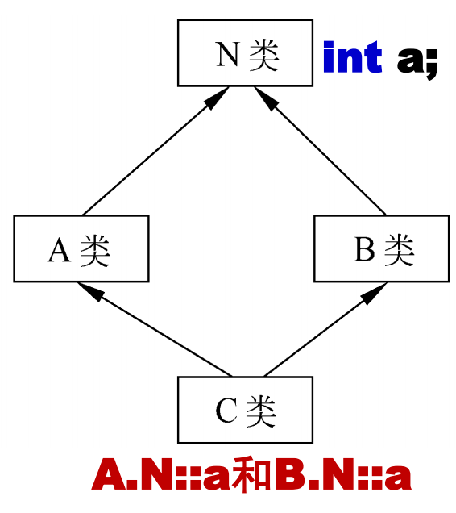

# Cpp考前复习(2)

## I. 类与对象

一个类的定义形如:

```c++
class A {
    private:  //私有成员
        int x;
    public:  //公有成员
        void f(A a);
    protected:  //保护成员
        ...
};  //一定注意此处的分号
```

若不加成员类型的说明, 默认其为 `private` 成员.

系统不会为类分配空间, 而只会为建立的对象分配空间.

区分构造函数, 复制构造函数, 析构函数.

### 构造函数

每次定义一个新的对象时, 系统自动调用相应的构造函数.

构造函数与类名相同, **无函数返回类型**, 定义在 `public` 成员中.

构造函数的定义形如:

```c++
...
public:
    A(int a, int b){...}
...
```

- 类中未给构造函数时, 编译器会自动提供默认构造函数 `A(void){}` .
- 构造函数**重载**: 可以同时有含参与无参的构造函数:

```c++
A(){...}  //无参构造函数
A(int a, int b){...} //含参构造函数
```

- 构造函数也可以含**默认参数**, 但这种用法不能与上面的重载构造函数同时存在.

```c++
A(int a = 0, int b = 1){...}
```

- 构造函数亦可以含有**对象**, 此时需要给出声明, 并先调用对象的构造函数:

```c++
class A {...};  
class B {...};
class C {
private:
    A a1;
    B b1;  //定义A, B类的对象
    ...
public:
    C (int x, int y): b1(y), a1(x)  //调用A, B类的构造函数
    {...}
};
```

*注*: 构造函数的调用顺序仅与**对象定义顺序**有关. 例如, 在上例中, 先调用A, 再调用B.

### 析构函数

每次注销一个生命期结束的对象时, 系统自动调用析构函数.

析构函数名为类名前添加 `~` , **无函数返回类型**且**无参数**.

析构函数的定义形如:

```c++
~A(){...}
```
- 析构函数只有一个, **不可重载**.
- 类中含有对象时, 先调用自己的析构函数, 再调用对象的析构函数. 即: 析构函数调用顺序与构造函数相反.

### 复制构造函数

- **使用情况**:
  - **复制初始化**: `A a2(a1);` 或 `A a2 = a1;` . (`a1`是`A`类的对象)
  - 函数的参数为对象: `f(a1);`
  - 函数的返回值为对象: `return a;`
- 复制构造函数与类名相同, 其参数为**该类对象的<font color = 'red'>引用</font>**. 常常为**Const引用**(以此确定再复制过程中, 原对象不会被修改) :

```c++
A(const A &a){...}  //a即为需要被复制的对象
```

### 运算符的重载

一个运算符的重载形如: 

```c++
A operator+(A const &a2)
//在此处, const& 并非必要, 但可以提高程序的运行效率, 减少相关错误.
```

- 成员函数运算符重载的等价形式: `a1.operator+(a2);` .
- `++` 及 `--` 的重载:

```c++
A operator++();  //前置
A operator++(int);  //后置
// 需要注意: 前置++返回的是运算后的值,
// 而后置++返回的是运算前的值, 但同时*this指针的值被改变了.
```

- 不可重载的运算符: `? :` , `.` , `*` , `::` , `sizeof()` .

### 友元函数

友元函数可以定义在类中的任意位置, 形如:

```c++
friend A operator+(A a1, A a2){...}
```

- 友元函数可以访问类内的所有成员.
- 访问类内成员时必须添加 `.` , 例如 `a1.x` .
- 友元函数运算符重载的等价形式: `operator+(a1, a2);`
- 友元函数不能重载 `=` 运算符.
- 友元函数无 `this` 指针.

### 静态数据成员

类的静态数据成员的定义形如: 

```c++
class A{
private:
    static int a;  //建议置于私有
...
};
int A::a = 0;  //必须进行定义性说明
```

- 无论有多少个对象, 均**共享一个**静态数据成员. (可用其统计对象数目)
- **不能**使用构造函数中的参数初始化表, 形如 `A(int b): a(b){...}` .
- 静态成员函数无 `this` 指针.

## II. 模板与数据结构

### 函数模板

函数模板实现了对不同类型的数据执行相同操作.

一个函数模板的定义形如:

```c++
template <typename T>
T f(T a, T b){...}
```

- 调用时, 如 `f<int>(a1, a2)` (或直接写作 `f(a1,a2)` ) 称为**模板函数**.
- 函数模板声明时必须包含**变量名称**.

### 类模板

类模板生成了一个数据类型可变的类的框架.

类模板的定义形如:

```c++
template <typename T> class A{
private:
    T x;
public:
    F(T a, T b);
};
//下面是在类外定义成员函数的语法
template <typename T> 
T A<T>::F(T a, T b){...} //注意, 需要在类名后添加<T>
//下面是建立对象的语法
A<int> a1(x,y);  //x,y是int类型的数据
```

### 线性表

线性表是一种数据结构, 数组就是一种线性表.

- 查找算法: 折半查找(对于**顺序表**使用, 还需注意区分升序与降序), 顺序查找.
- 排序算法: 插入排序, 冒泡排序, 选择排序.
  - 插入排序: 对于前面 `i-1` 个数据形成的已排序数组, 将新的元素按顺序插入其中.
  - 冒泡排序: 从尾至头进行, 若任意相邻的两个数据顺序不符, 则进行交换. 若从尾至头无交换, 说明排序完成.
  - 选择排序: 在未排序数组中找到最小值, 与数组的第 `i` 位交换.

### 链表

用非连续的存储空间来存储线性表. 链表也是一种线性表.

- 区分: 是否含有头节点.
- 由节点类, 链表类共同构成.

```c++
template <typename T> class Node{   //节点类
private:
    T info;  //数据域
    Node<T> *link;  //指针域, 该指针指向一个节点对象
public:
    Node(); //生成表头结点的构造函数
    Node(const T & data); //生成一般结点的构造函数
    friend class List<T>;  //以链表类为友元类
    ...  //相关功能的实现: 如插入/删除后继节点
};
template <typename T> class List{  //链表类
private:
    Node<T> *head, *tail;  //存放头指针与尾指针
public:
    List(); //构造函数，生成头结点(空链表)
    ~List(); //析构函数
    ...  //相关功能的实现
};
```

### 栈与队列

两者均为特殊的线性表形式, 可用数组或链表来表示.





## III. 动态内存分配

- 自由存储区(**堆区**): 进行动态内存分配的区域.
- `new`与`delete`: 进行内存申请与释放. 其语法形如: 

```c++
int *p1 = new int(5);                //申请元素并初始化
int *p2 = new int[5];                //申请数组
int *p3 = new int[5]{1, 2, 3, 4, 5}; //申请数组并初始化
delete p1;                 //释放元素
delete []p2; delete []p3;  //释放数组
//注: 此处不可以写作 delete []p2, p3. 编译器只会析构p2.
```

### 深复制与浅复制

- 浅复制: 复制后新的指针仍指向原来的对象:



- 深复制: 复制后的指针被分配到新的堆区对象:



- 实现方法: 复制构造函数, 等于号的重载.
  - 新开辟内存空间, 用以存放新的堆区对象.

## IV. 继承与多态

三种派生方式: public, private, protected.



### 派生类的构造函数

语法形如:

```c++
class A{
public:
    A(int a, int b) {...}  //基类的构造函数
    ...
};
class B{
public:
    B(int c, int d){...}  //同上
    ...
};
class C: public A, private B {//注: 调用构造函数要看此处的顺序!
//C是A, B的多重继承类
public:
    C(int a, int b, int c, int d, int e):
    B(c, d), A(a, b){  //注: 构造函数的调用顺序与此处完全无关!
        //此处为涉及到C类自身参数e的相关初始设定
    }//注: 若B的构造函数无参数, 
    // 则B(c,d)可以省略, 但系统仍然执行其构造函数
}
```

### 二义性

- 含同名成员时, 父类成员在子类中被隐藏, 使用 `A::a` 来调用.
- **虚基类**: 涉及多重派生, 如图: 其中N为虚基类



虚基类的声明形如：

```c++
class N {...};  //间接基类(虚基类)
class A: virtual public N {...};
class B: virtual public N {...};
// 在直接基类的声明时需添加virtual
class C: public A, public B {...}
```

- **赋值兼容**: 子类向父类赋值.
  - 派生类**对象**可向基类对象赋值. (舍弃部分自己的成员)
  - 派生类**对象地址**可向基类**对象指针变量**赋值. (基类对象的指针将指向派生类对象)
  - 派生类**对象**可初始化基类**对象引用**. (该基类的对象成为了派生类对象的别名)
  - 以基类对象为**形参**的函数, 其**实参**可以为派生类对象.

### 多态性与虚函数

- 多态性: 对于同一个函数, 在不同的对象(类)中由不同的结果.
- **虚函数**: 在派生类中重新定义与基类同名的函数, 可通过基类指针访问同名函数.
  - 某类的成员函数被定义为虚函数后, 该类的所有派生类中该函数均为虚函数.
  - **析构函数可以为虚函数, 构造函数不可为虚函数**.

虚函数的定义形如:

```c++
class A  //基类
{
public:
void virtual display( ) {cout << "x\n";}
};  //基类中定义时需要添加virtual声明为虚函数
class B: public A  //派生类
{
public:
    void display( ) {
        cout << "Ellipse\n";
    } //在派生类中, 可以不写virtual
};
```

- **纯虚函数**: 基类中无该函数, 但在各派生类中存在该函数的不同实现.
  - 含有纯虚函数的类被称为**抽象类**.
  - 抽象类**无法定义对象**.

纯虚函数的定义形如:

```c++
class A  //基类
{
public:
float virtual F( ) = 0;
};  //这里的=0起到说明F为虚函数的作用
class B: public A  //派生类
{
public:
    float F( ) {...} 
    //在派生类中, 可进一步具体的定义虚函数F
};
```

## V. 输入输出流

### 流类库

- `cout`, `cin` 为 `iostream` 类中的对象.
- `>>` 为提取符号, `<<` 为插入符号.
- 上述两个符号的重载只能为**友元函数**, 且输入输出流的对象必须为**引用形式**, 形如 `ostream &output` .

### 文件输入输出

步骤:

- 定义 `ofstream` 或 `ifstream` 的对象.
- 用 `open` 函数打开文件.
- 进行文件的读写操作.
- 用 `close` 函数关闭文件.

<完>