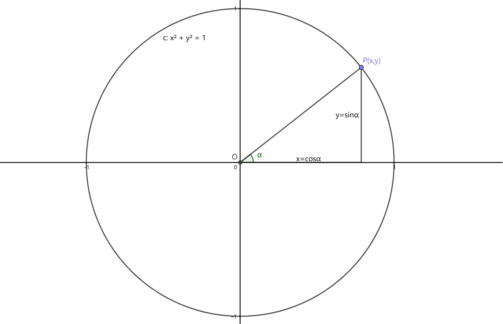

<head>
    <script src="https://cdn.mathjax.org/mathjax/latest/MathJax.js?config=TeX-AMS-MML_HTMLorMML" type="text/javascript"></script>
    <script type="text/x-mathjax-config">
        MathJax.Hub.Config({
            tex2jax: {
            skipTags: ['script', 'noscript', 'style', 'textarea', 'pre'],
            inlineMath: [['$','$']]
            }
        });
    </script>
</head>

# 第零章 数学基础

>物理学的本质之一就是对现实世界进行数学建模。因此，谈物理避不开了解其背后的数学工具。古往今来，数学不断为物理提供着了解真实世界的工具，物理学的发展也在不断地位数学大厦添砖加瓦。<br>
**注意**：这不是专业的数学教程，一些过于严谨的或较为显然的证明将被略去。在本文中可能会提到一些公式的识记方法，但最好的方式是将它们勤加应用。

### 0.1 三角函数
物理学是研究真实世界物质的科学。由于其研究对象的客观实在性，不免需要利用几何关系。因此，熟练利用三角函数来表示涉及角度的几何关系便十分重要。

三角函数最直接的定义是由一个直角三角形给出的。设其直角边为 $a,b$ ，斜边为 $c$ ，则有：

$$
sinθ=\frac{a}{c} ,\ cosθ=\frac{b}{c} ,\   tanθ=\frac{a}{b}.\quad(θ∈(0,90°)) 
$$

为了不失一般性，我们引入平面直角坐标系中半径为1的圆 $C:x^2+y^2=1$ 作为单位圆，并定义了弧度制下角的大小，即：

$$
\alpha=\frac{l}{R},\ sin\alpha=\frac{y}{R},\ cos\alpha=\frac{x}{R},\ tan\alpha=\frac{y}{x}.\quad(\alpha\in\mathbb{R})
$$


<center>Figure 0.1 三角函数的定义</center>

另外，我们还定义了余切、正割、余割函数，他们是：

$$
cot\theta=\frac{1}{tan\theta}\ ,\ \ sec\theta=\frac{1}{cos\theta}\ ,\ \ csc\theta=\frac{1}{sin\theta}\ .
$$

三角函数有所谓的“诱导公式”，其本质是关于其图像周期的平移，这里不再赘述。

需要我们注意的是，三角函数之间有一些极为重要的平方和关系，它们不仅可以用于物理图像的几何分析，更在后续微积分中的一些“数学游戏”里有重要作用：

$$
\begin{aligned}
{sin^2θ +cos^2θ=1}\\
{tan^2θ+1=sec^2θ}\\
{cot^2θ+1=csc^2θ}
\end{aligned}
$$

这组等式可以直接由各三角函数在单位圆中的表示得出，此处从略。

在了解了各三角函数之间的关系后，我们还想知道角度和差的三角函数，即三角函数的**两角和差公式**：

$$
\begin{aligned}
\cos{\left(\alpha-\beta\right)}=cos\alpha\ cos\beta+sin\alpha\ sin\beta\qquad\left(1\right)\\
cos{\left(\alpha+\beta\right)}=cos\alpha\ cos\beta-sin\alpha\ sin\beta\qquad\left(2\right)\\
\sin{\left(\alpha+\beta\right)}=sin\alpha\ cos\beta+cos\alpha\ sin\beta\qquad\left(3\right)\\
\sin{\left(\alpha-\beta\right)}=sin\alpha\ cos\beta-cos\alpha\ sin\beta\qquad\left(4\right)
\end{aligned}
$$

记住这组公式不是很难，我们只需知道第一个公式的推导过程：设单位圆中 $\vec{a}=\left(cos\alpha,sin\alpha\right)\ ,\ \vec{b}=(cos\beta,sin\beta)$  ，则 $cos{\left(\alpha-\beta\right)}=\vec{a}\cdot\vec{b}$ ，等式(1)得证。后面的三个等式都可由此推出。

以上内容在高中数学教科书上均可找到，而更加重要的是在教科书上被删去的内容。在实际问题求解中，我们有时需要将相乘的三角函数拆开变为线性相加关系，以利于积分或投影等运算；有时需将线性相加关系转化为相乘关系，以利于进行因式分解等操作。针对前者，我们导出了**积化和差公式**；针对后者，我们导出了**和差化积公式**。

其推导只需将两角和差公式进行加减即可得到，如 $\frac{(3)+(4)}{2}$ 即得到积化和差的第一式，其余不再赘述。

$\boxed{积化和差}$

$$
\begin{aligned}
sin\alpha cos\beta=\frac{1}{2}[sin(\alpha+\beta)+sin(\alpha-\beta)]\\
cos\alpha sin\beta=\frac{1}{2}[sin(\alpha+\beta)-sin(\alpha-\beta)]\\
cos\alpha cos\beta=\frac{1}{2}\ [cos(\alpha+\beta)+cos(\alpha-\beta)\ ]\\
sin\alpha sin\beta=-\frac{1}{2}\ [cos(\alpha+\beta)-cos(\alpha-\beta)]
\end{aligned}
$$

$\boxed{和差化积}$

$$
\begin{aligned}
sin\theta+sin\phi=2\sin(\frac{\theta+\phi}{2}) \cos(\frac{\theta-\phi}{2})\\
sin\theta-sin\phi=2\cos(\frac{\theta+\phi}{2})\sin(\frac{\theta-\phi}{2})\\
cos\theta+cos\phi=2cos(\frac{\theta+\phi}{2})\ \cos(\frac{\theta-\phi}{2})\\
cos\theta-cos\phi=-2\sin(\frac{\theta+\phi}{2})\ \sin(\frac{\theta-\phi}{2})
\end{aligned}
$$

直接记住这些公式是较困难的，我们有如下口诀：

```
正余余正，正加正减；

余余正正，余加负余减。
```

从左至右读对应积化和差公式，从右至左读对应和差化积公式。两者互为逆运算。需要注意的是系数2与 $\frac{1}{2}$  ，这可以通过带入某些特殊值，如 $\alpha=\beta$ 来辅助记忆。

当然，记忆公式是一个仁者见仁的事。笔者在此列出了这些三角公式，目的是在后续的物理问题求解中可以更加得心应手。 $\blacksquare$

下一节：[0.2 双曲函数](0_2.html)

回到[目录](physics1.html)
