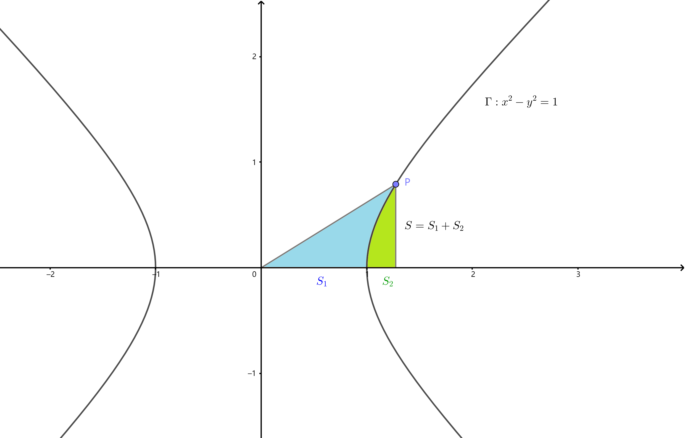

<head>
    
    
</head>

### 0.2 双曲函数

在一些物理的结果中，常常含有许多指数与对数项。此时，利用<strong>双曲函数(Hyperbolic function)</strong>或其反函数可以将结果化简成更为简洁的形式。

#### 0.2.1 双曲函数的定义
双曲函数可以视作以指数函数为自变量的函数。我们注意到这样的一些函数有特别的性质，故分别定义**双曲正弦**、**双曲余弦**、**双曲正切**为：

$$
\begin{aligned}
\sinh\alpha=\frac{e^\alpha-e^{-\alpha}}{2}\\
\cosh\alpha=\frac{e^\alpha+e^{-\alpha}}{2}\\
\tanh\alpha=\frac{e^\alpha-e^{-\alpha}}{e^\alpha+e^{-\alpha}}
\end{aligned}
$$

注：它们也可写作省略形式： $\mathrm{sh}\alpha,\ \mathrm{ch}\alpha,\ \mathrm{th}\alpha$ 。

其中，由于双曲余弦具有特别的物理意义，我们也称其为**悬链线**。关于此的详细内容请见 *[附录1](附录1的链接)*。

不难发现，双曲函数的正余弦与余切之间仍然存在关系：

$$
\tanh\alpha=\frac{\sinh\alpha}{\cosh\alpha}
$$

另外，可以发现 $y=\sinh x$ 与 $y=\tanh x$ 为奇函数，而 $y=\cosh x$ 为偶函数。

Figure 0.2 双曲函数的图像

从图像上可以看出，当 $x\to+\infty$ 时双曲弦函数也趋于无穷，这是由于 $x\to\infty$ 时 $e^{-x}\to0$ ，则 $y\to e^x\to+\infty$ 。

综上所述，双曲函数与三角函数之间具有一些极为相同的性质。事实上，这些相似性造就了很多情况下三角函数与双曲函数的等价性，我们将会在微积分的学习中领略其作用。

然而，我们需要记住双曲函数的特别之处，即：

$$
\boxed{\mathrm{sh}^2x-\mathrm{ch}^2x=1}\tag{1}
$$

我们如何类比三角函数理解这一特别性质？且听下回分解。

#### 0.2.2 双曲函数的几何意义

类比定义三角函数时引入的单位圆，由（1）式，我们引入**单位双曲线**： $\Gamma:x^2-y^2=1$，对其上一点$P(x,y)$ ，令

$$
x=\sinh\alpha,\ y=\cosh\alpha
$$

与定义三角函数时 $\alpha$ 表示旋转角度不同，这里的 $\alpha$ 并没有很显式的几何意义。不过，我们可以类比三角函数定义中角度与弧长的对应关系，即： $l=\alpha,\ S=\frac{\alpha}{2}$ 。我们选用后者来推导，这是因为双曲线围成的面积比弧长更好计算。

Figure 0.3 双曲线围成的面积

由图易知，所求的面积与总面积S之间满足： $S_1=S-S_2$ 。其中，S可以由直角三角形的面积得出，而 $S_2$ 则需要求解积分 $\int_1^x\sqrt{x^2-1}\ \mathrm{d}x$ ，我们在不久的将来即可知道其求解方法，此处从略。

总而言之，经过计算后我们可以得到：

$$
\alpha=\ln(x+\sqrt{x^2-1}) \tag{2}
$$

反解出x，得到

$$
x=\cosh\alpha=\frac{e^\alpha+e^{-\alpha}}{2}
$$

同理解出y与 $\frac{y}{x}$ ，我们便得到了三个双曲函数的几何定义。

#### 0.2.3 反双曲函数

既然双曲函数简洁地表示了某些含有 $e^x$ 的复杂式子，反之，反双曲函数则用于处理含 $\ln x$ 的复杂公式。

事实上，式（2）已经给出了**反双曲余弦**的定义，即

$$
\mathrm{arch}x=\alpha=\ln(x+\sqrt{x^2-1})
$$

其中"arch"即表示反双曲余弦。

同理可得**反双曲正弦**为：

$$
\mathrm{arsh}x=\alpha=\ln(x+\sqrt{x^2+1})
$$

顺便一提，此处反双曲函数不写成arc...x并非笔误而漏掉了"c"，而是由于其定义如此。一种解释是， $\alpha=\arcsin x$ 中的arc意为“弧”，表示着 $\alpha$ 是由弧长定义的；而这里的ar意为“面积(area)”，表示着双曲函数中的 $\alpha$ 是由面积定义的。 $\blacksquare$

下一节：[0.3 坐标与参数方程](0_3.html)

回到[目录](cong344.github.io/physics1.html)
