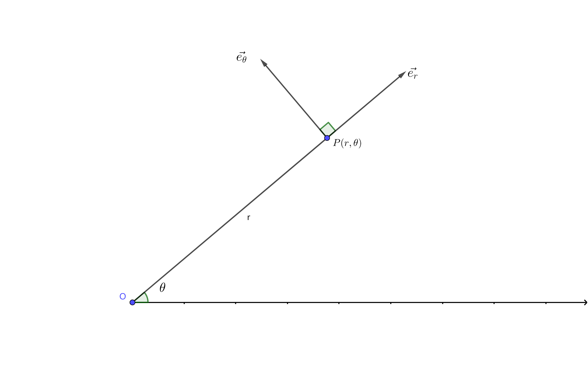
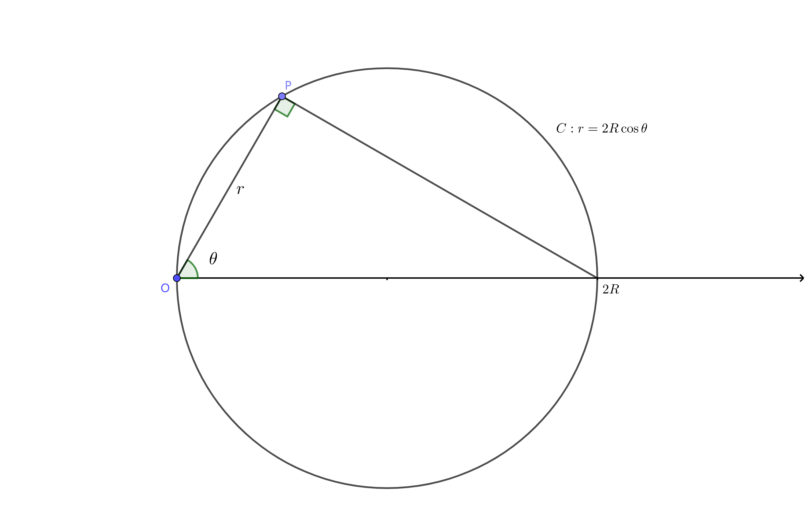
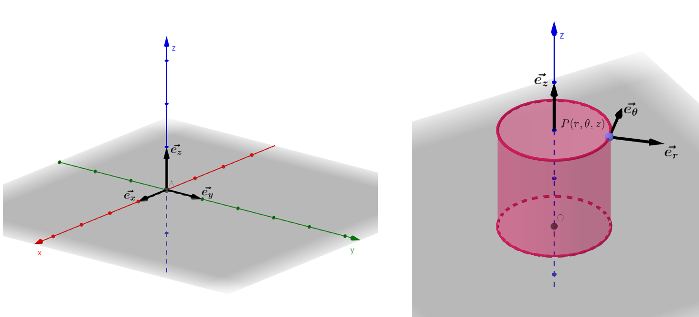

<head>
    
    
</head>

### 0.3 坐标系与参数方程

在中学数学学习中，我们解决大部分问题时均使用直角坐标系。对于平面上的某个曲线，我们习惯于用方程 $f(x,y)=0$ 来将其表示。但事实上，很多时候直角坐标系并不能够满足我们表示曲线或解决具体物理情境的需求，我们需要使用其他坐标系来进行补充。

#### 0.3.1 坐标系概论

为了使后文更加清晰，我们先简略的说明何为**坐标系**：在2维（或3维）空间中，存在2个（3个）**单位正交基底**。用其表示空间中的任意点，即构成一个坐标系。

例如： $\vec{OA}=a\vec{e_a}+b\vec{e_b}$ 。则A在该坐标系下坐标即为(a,b)。而 $\vec{e_a}$ 与 $\vec{e_b}$ 需要满足：

$$
\vec{e_a}\perp\vec{e_b}, \ |\vec{e_a}|=|\vec{e_b}|=1
$$

在后续的线性代数学习中，我们将会学到关于坐标及其基底的更多内容。

#### 0.3.2 参数方程

参数方程的提出具有很强的物理背景。对于任意一个曲线，我们可以将其想象为一个质点运动的轨迹。其可能并没有显式的表达式，但根据线性叠加思想，我们一定可以描述其在各个方向的分运动。

因此，我们引入参数t。因此，对二维运动的情况，即有：

$$
\begin{cases}
x=x(t) \\
y=y(t) \\
\end{cases}
$$

对于三维运动的情况，只需要再添加z分量： $z=z(t)$ 即可。

在数学上，t只是引入的一个参量，我们借此形成了一个3个未知数、两个方程的方程组，用以表示一个曲线。其意义在于：在某些情况下，曲线的自变量被统一了。

但结合上面一段文字，我们也可以知道t的物理意义：质点运动方程中的时间参数(time)。即：已知x方向与y方向的运动，其合运动所形成的轨迹即可由参数方程来进行描述。

参数方程对于已知运动求轨迹起到了重要作用，比如**旋轮线**与**对数螺线**的推导。详细内容请见 *[附录2](appendix2.html)* 。

#### 0.3.3 平面坐标系

本节中，我们介绍两种常用的平面坐标系以及他们的转化关系。

利用原点O、x值、y值描述平面上任意各点的坐标系称为**平面直角坐标系**，亦称为**笛卡尔坐标系**，这种坐标系我们已经相当熟悉。对平面上一点P，我们可以用 $P(x,y)$ 来表示其坐标。此时，坐标系的基底可表示为：

$$
\vec{e_x}=\frac{\vec{x}}{x},\ \vec{e_y}=\frac{\vec{y}}{y}
$$

注：在许多场景下，这对基底也被写作 $(\hat{i},\hat{j})$ 或 $(\hat{x},\hat{y})$ ，他们的上标为"hat"，可以读作“帽”。请注意识别。

可能读者会疑惑：在坐标表示中，我们从来都是使用基底来表示坐标，为什么这里用坐标来推理出基底？请看下面极坐标的分析。

同样已知一固定点O,我们称其为**极点**，并选取一固定射线，称其为**极轴**，这便是**极坐标系**。对平面上一点P, $\vec{OP}$ 与极轴的夹角 $\theta$ 称为**极角** ； 而 $\overline{OP}$ 的长度 r 称为**极径**。由此，P点的坐标可以写作 $P(r,\theta)$ 。

这时，坐标系的基底之一被定义为：

$$
\vec{e_r}=\frac{\vec{r}}{r}
$$

根据正交基底的定义，我们显然知道另一基底的大致样貌，其满足：

$$
\vec{e_\theta}\perp\vec{r},\ |\vec{e_\theta}|=1
$$

在学习矢量叉乘后，我们会知道： $\vec{e_\theta}=\vec{e_z}\times\vec{e_r}$ ，这是后话。

注：与直角坐标系类似地，这对基底也被写作 $(\hat{r},\hat{\theta})$ 。

Figure 0.4 极坐标的定义

由图像，我们可以很显然地看出极坐标与直角坐标之间的转化关系。即：

$$
\begin{cases}
x=r\cos\theta \\
y=r\sin\theta \\
\end{cases}
\tag{1}
$$

可以看出，这个方程组构成了以 $\theta$ 为参量的一个参数方程。

同样地，若从直角坐标转化为极坐标，则有：

$$
\begin{cases}
r=\sqrt{x^2+y^2} \\
\theta=\arctan\frac{y}{x}\\
\end{cases}
\tag{2}
$$

在这里，我们给出一些常见曲线的极坐标表示。他们均可由(1)、(2)两式推出。

$$
\text{圆：}\ r=2R\sin\theta\  \text{或}\ r=2R\cos\theta
$$

Figure 0.5 圆的极坐标表示

$$
\text{圆锥曲线：} \ r=\frac{p}{1-e\cos\theta}
$$

其中，p为**半通径**（即通径长度的一半），e为**离心率**。由解析几何的知识，e的正负决定了圆锥曲线的类型。

#### 0.3.4 空间坐标系

在描述空间上的点时，也有很多种坐标系可供选择，这取决于具体情况的几何特性。

较简单的两个空间坐标系分别为**空间直角坐标系**与**柱坐标系**。他们均是在垂直于平面坐标系的方向上添加了z轴，该方向基底向量被定义为：

$$
\vec{e_z}=(0,0,1)
$$

注： $\vec{e_z}$ 有时也被表示为 $\hat{z}$ 或 $\hat{k}$ 。

Figure 0.6 空间直角坐标系与柱坐标系

而另一种较复杂的空间坐标系为**球坐标系**，其对于描述球面上的点有着重要意义。

考虑一个球体，其内任意一点P可被描述为 $P(r,\theta,\varphi)$ 。其中，r是 $\overline{OP}$ 的长度，而 $\theta$ 是P点的**经度**， $\varphi$ 是P点的**纬度**。关于经纬度的精准定义，请参考地理学的相关知识。

此时， $\overline{OP}$ 方向的基底向量被定义为：

$$
\vec{e_r}=\frac{\vec{r}}{r}
$$

经度方向基底向量 $\vec{e_\theta}$ 被定义为：

$$
|\vec{e_\theta}|=1,\ \text{方向沿P处纬线圈的切线向}.
$$

同理，纬度方向基底向量 $\vec{e_\varphi}$ 被定义为：

$$
|\vec{e_\varphi}|=1,\ \text{方向沿P处经线半圆弧的切线向}.
$$

注：基底向量也可以写作 $(\hat{r},\hat{\theta},\hat{\varphi})$ 。

Figure 0.7 球坐标系

由图像，我们也可以得到由球坐标系向直角坐标系的转化公式：

$$
\begin{cases}
x=r\sin\varphi\sin\theta \\
y=r\sin\varphi\cos\theta \\
z=r\cos\varphi \\
\end{cases} 
$$

$\blacksquare$

下一节：[0.4 数列与级数](0_4.html)

回到[目录](https://cong344.github.io/physics1/index.html)
